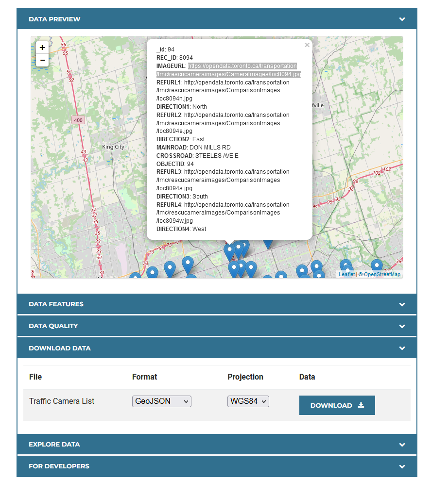
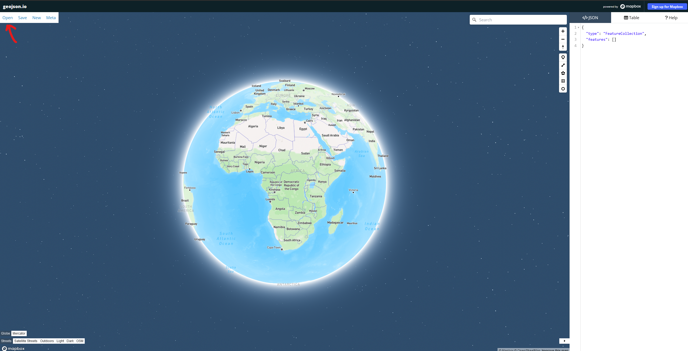

  <h1>Toronto Traffic Camera API</h1>
  <h4>Node.js • Express • Supabase</h4>

<h1>Contents</h1>

- [Overview](#overview)
- [Technologies](#technologies)
- [Installation](#installation)
- [Make your own API](#api)

<h1 id="overview">Overview</h1>

This API provides access to Toronto's traffic cameras, allowing developers to integrate live camera feeds into their applications. The API is built using Node.js, Express, and Supabase, offering a simple and easy-to-use interface.
<h1>Technologies</h1>

<table>
  <tr> 
    <td align='center'></td>
    <td align='center'></td>
    <td align='center'></td>
    <td align='center'></td>
  </tr>
 </table>

<h1>Installation</h1>

To use this app, follow these steps:

    Install Node.js on your computer.
    Clone this repository to your local machine.
    Install the required dependencies using npm install

<h1>Usage</h1>

To run the app, execute the following command in your terminal:

npx nodemon --exec ts-node src/index.ts

The app will be available at http://localhost:3000. You can use the app to upload images and get information about the content of the images. The app can also be containerized using Docker for easy deployment and scaling.

<h1 id="api">Want to make your own API?<h1>

Go to https://open.toronto.ca/dataset/traffic-cameras/ and scroll down to the bottom. Download the data in Geojson format. This will allow you to load the data on different mapping applications like `google maps`, `esri`, `mapbox`, `cesium`, etc.

To view the data, go to https://geojson.io/#map=2/0/20 and then click the `Open` button and select the data you just downloaded. 

